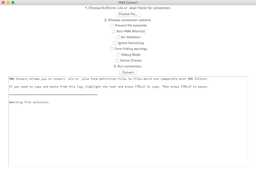

# QTools2: Questionnaire Tools for ODK

Qtools2 provides tools and utilities for dealing with PMA2020 questionnaires. It converts the XLSForms to XML and then does all appropriate edits. It also can be used as a simple XLSForm Offline converter.

The code is necessarily written for Python 2 because it depends on a fork of the [community's PyXForm][1a] (the fork is called [pmaxform][1b]) to convert MS-Excel documents into XML. We just have to live with this annoyance.

[1a]: https://github.com/XLSForm/pyxform
[1b]: https://github.com/jkpr/pmaxform


## Pre-requisites

QTools2 relies on Python 2 for core functionality and Java for ODKValidate. The steps to install are

* Install the most recent version of [Java][2] (currently 1.8). ~~Either the JRE or JDK should work.~~ Only the JDK worked when last tested on Mac (March 2017).
* Install [Python 2.7][3].

Note: the author uses [Homebrew][4] for Python installation on Mac.

[2]: http://www.oracle.com/technetwork/java/javase/downloads/index.html
[3]: http://www.python.org/downloads/
[4]: http://brew.sh/

## Windows-specific steps

Some difficulties arise if `python` and `pip` are not be added automatically to the `PATH` upon installation. Open `CMD` (click start menu, type `CMD`, press enter). Naviagate to your `pip` executable, probably here:

```
cd C:\Python27\Scripts
```

Continue with installation or upgrade...

## Installation

NOTE: Windows users start with the _**Windows-specifc steps**_ section. This package uses a modified version of `pyxform` called `pmaxform` because the PyXForm project thus far has refused to accept this author's pull requests for some simple improvements. Therefore, installation requires *two* commands instead of *one*. Open CMD or Terminal and install relevant packages **separately**, and **in order**

First,
```
pip install https://github.com/jkpr/pmaxform/zipball/master
```
Second,
```
pip install https://github.com/jkpr/QTools2/zipball/master
```

For the latest and greatest, replace `master` in the URLs above with `develop`.

# Usage

After installation, the code that can convert XLSForms is saved in Python's code library. This means anywhere Python can be accessed, so can `qtools2`.

In order to use `qtools2`, there are two primary ways. The simpler way is to point and click on a specific file ([example specific file][5]) saved in any folder, such as Downloads, to get Python to run that file. The other way is to use the command line.

[5]: https://raw.githubusercontent.com/jkpr/QTools2/master/scripts/pma-convert.py

## Easiest way to use `qtools2` for PMA2020 forms on Windows

The easiest way to use `qtools2` is to use a file from the `scripts` [folder of this repository][6]. In order to download a script, click its link, then click "Raw," then save the contents (in the browser, File > Save). The table below explains what is available.

|      Script name      | Purpose |
| --------------------- | ------- |
| `xlsform-convert.py`    | Convert one or several of *any* kind of XLSForm with a GUI. |


Windows usually associates `.py` files with the Python executable. Thus, a Windows user should only need to double-click the script file icon. That starts the Python interpreter and runs the code.

On a Mac, double clicking a `.py` file usually opens a text editor. To run the file as code, right click the script file icon, then select "Open with > Python Launcher (2.7.12)." The Python version number may be different.

### Alternative

If the above is too hard, it is possible to achieve the same functionality in a different way. Open up a Python interactive session (perhaps open IDLE, perhaps open Terminal and type `python`). Then copy and paste the same text that is in the desired script into the interpreter, press "Enter," and voila.


[6]: https://github.com/jkpr/QTools2/tree/master/scripts
[7]: https://gumroad.com/l/xlsform-offline

## Easiest way to use `qtools2` on a Mac (also on Windows)

For those who wish to use a GUI initiated from the command line, the QTools2 pipeline begins thusly

```
python -m qtools2
```

> 
>
> _Screenshot of the QTool2 graphical user interface._

You can check the usage by adding the `--help` flag to the above command.

It is possible to use this command on Windows. The Windows-specific steps may be needed.

NOTE: the `-v2` option has been removed as of 0.2.3.


## Command-line usage

Besides being the workhorse of `qtools2`, the module `qtools2.convert` also provides a command-line utility. New-style linking (with all instructions contained inside the XLSForm) is now the default. Old-style linking (line-by-line manual XML editing instructions) is removed. To see help files and usage, run in the terminal

```
python -m qtools2.convert --help
```

#### Quick-start guide

| Type of conversion | Command |
| ------------------ | ------- |
| PMA form conversion                                   | `python -m qtools2.convert FILENAME [FILENAME ...]`    |
| XLSForm-Offline equivalent, convert and validate      | `python -m qtools2.convert -ril FILENAME [FILENAME ...]`     |

#### Options
| Short Flag | Long Flag | Description |
| --- | --- | --- |
| -r | --regular | This flag indicates the program should convert to XForm and not try to enforce PMA-specific naming conventions or make linking checks for HQ and FQ. |
| -p | --preexisting | Include this flag to prevent overwriting pre-existing files. |
| -n | --novalidate | Do not validate XML output with ODK Validate. Do not perform extra checks on (1) data in undefined columns, (2) out of order variable references. |
| -i | --ignore_version | Ignore versioning in filename, form_id, form_title, and save_form. In other words, the default (without this flag) is to ensure version consistency. |
| -l | --linking_warn | Produce warnings for incorrect linking directives. Default is to raise an exception and halt the program. |
| -d | --debug | Show debug information. Helpful for squashing bugs. |
| -e | --extras | Perform extra checks on (1) data in undefined columns and (2) out of order variable references. |
| -s | --suffix | A suffix to add to the base file name. Cannot start with a hyphen ("-"). |

## Extras

### Translation Regex Mismatches
These QTools2 conversion warning messages appear whenever there is a discrepancy between translations with respect to numbering, i.e. `'[0-9]+'`, and/or variables, i.e. `'${...}'`.

*Example - Numbering Mismatch*

In this example, the warning `'[0-9]+'` will appear, because "0" is not the same things as "zero". To fix this, please ensure that ALL languages use only arabic numerals (e.g. 1, 2, 3...), or only word-based numbering (e.g. one, two, three...).
  * English: Please enter 0.
  * Bad Pidgin English: Please enter zero.

*Example - Variable Mismatch*

ODK variables should never be translated. If the main language shows "${months}", all language translations should also show "${months}". Of course, what the user sees on the phone will still be translated.
  * English: Enter ${months}.
  * Bad French: Entrez ${mois}.

*Example - Variable Mismatch*

Translations should use all variables that the English uses.
  * English: There are ${hh_count} people in the household
  * Bad Pidgin English: There are (ODK will fill in a count) people in the household

## Updates

NOTE: Windows users start with the _**Windows-specifc steps**_ section. To install `qtools2` updates, use

```
pip install https://github.com/jkpr/QTools2/zipball/master --upgrade
```

For the latest and greatest, replace `master` in the URLs above with `develop`.

Every once in a while, it will be necessary to update `pmaxform`. To do this, use

```
pip install https://github.com/jkpr/pmaxform/zipball/master --upgrade
```

### Suggestions and Gotchas

- Check the version in the terminal to see if a program is installed.
- Check Java version with `javac -version`
- Check Python version with `python -V`.
- Check pip version with `pip -V`.
- Another executable for Python is `python2`.
- Another executable for `pip` is `pip2`.
- The most recent Java is not required, but successful tests have only been run with Java 1.6 through Java 1.8.
- A dependency of `pmaxform` is `lxml`, which can cause problems on Mac. If there are problems, the best guide is on [StackOverflow][8].
- During installation of `pmaxform` on Mac, the user may be prompted to install Xcode's Command Line Tools. This should be enough for `lxml`.
- Qtools2 may run without Java. Java is only needed for ODK Validate, which can be bypassed by using the "No validate" option.
- Xcode 9 presents issues with missing header files. If at all possible, install Xcode 8.

[8]: http://stackoverflow.com/questions/19548011/cannot-install-lxml-on-mac-os-x-10-9

### Bugs

Submit bug reports to James Pringle at `jpringleBEAR@jhu.edu` minus the BEAR.
